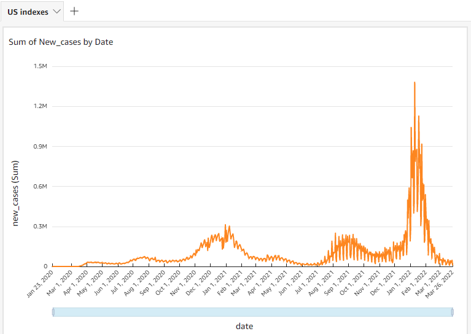

### AWS Pipe
This specific implementation uses the following AWS services in the following capacity.
- S3: Staging
- Athena: Query testing
- Redshift: Main RDS
- Quicksight: BI and visualization
- Glue: Orchestrator

#### Premise
The objective of this demonstration is to show how data can be transferred between different AWS services while makiing modifications to the source data, without losing its state or any queries during the process.

The pipeline involves the use of a CSV file stored within the simple storage system. The S3 bucket in use also serves as a platform for query testing and data staging through Athena.
We use the Glue orchestrator to modify the file and place it into the Redshift cluster. Our modifications involve changing the data types of specific data within the dataset, and cleaning the dataset
to allow for data analytics. Null values are present as the data is collected on a daily basis.
We then manually use Quicksight to analyze data within the Redshift cluster.

#### Results
Quicksight is able to access to the Redshift cluster and visualize charts and graphs from the data within the database (IAM access is required to avoid timeout errors).
A sample of a few visualizations is provided below.

