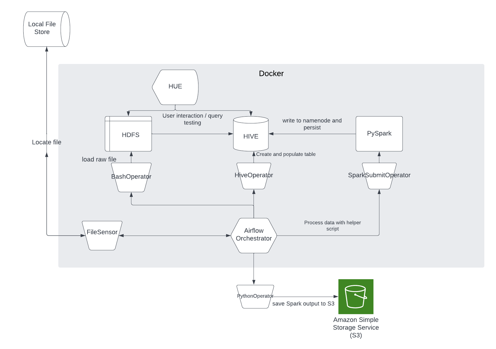
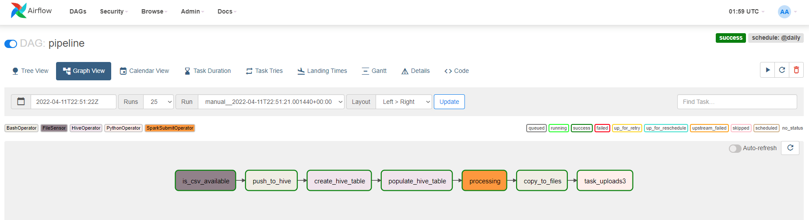
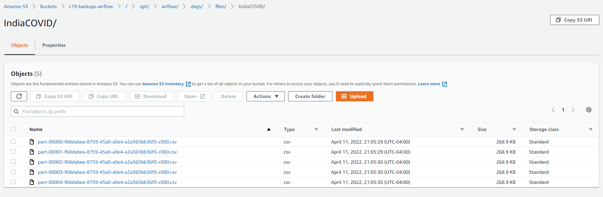

# A "basic" Airflow pipeline
First off, I'd like to thank Marc Lamberti for his resources on using Airflow and Docker. I wouldn't have been able to do this without him. Now, let us get into the juicy deets.

Most of the components used in this demonstration are run through Docker images, because I'm a Windows nooblet.
The architecture for this project (which you can find in the dockerfile) consists of the following:
- HIVE
- Hadoop
- Spark / PySpark
- HUE (for interaction with HDFS and HIVE QL)
- Airflow (2.1.4)
- S3 (external)

The idea of the workflow is to complete the following tasks:
- Load a local CSV into the docker containers.
- Preprocess and load this CSV into HIVE / HDFS.
- Transform the file to target specific conditions with PySpark.
- Write output into HDFS and persist.
- Save output to S3 for redundancy.

All of these tasks are done through a single Airflow DAG, and a helper PySpark script.

**Note**: I understand I could have done this entire process inside Spark itself, but the idea is to use multiple tools to accomplish this task.

## Result
After some debugging; the DAG ran successfully. I should let you know that this process is suboptimal for a couple of reasons - one is namely because I'm using a framework built for batch processing and storage and attempting to toss it into an object class storage system. We cannot control Spark's batch output naming conventions, so transferring files was a problem, especially when they constantly change. Second, Omitting Spark from this process and using HQL to extract and process data is also viable, and removes a component from the entire workflow - making it a bit easier to work with. Analytics with Hue, while limited - is more than enough for basic aggregations without using Python.

![DAG Complete] 

Compared to a "big data" dataset, our file is actually relatively small but it is a little interesting to know how long each task took. Spark seems to take the cake for this.

Task History:

Verifying files:

