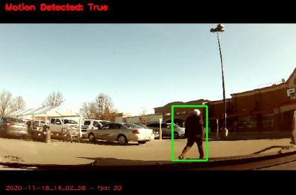
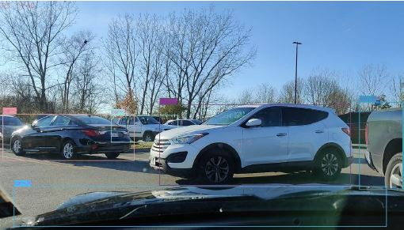
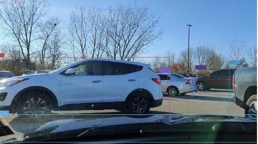
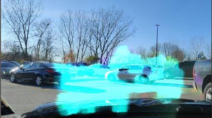

### Synopsis
This is an experimental algorithm that attempts to replicate a 'sentry' mode (thank you Tesla) for cars that are not IoT enabled using available open source tools.
As of this moment, I've tested OpenCV and a scratch YOLOV3 + DeepSORT alogrithm to detect and track moving objects within the view of a camera. While I've been running off a laptop so
I can test code on the fly, I will be able to run the YOLO algorithm off a Raspberry Pi, or a small form factor computer that can be fitted to a car.

### Results
Lots of false positives are noticed from the OpenCV algorithm, but the YOLOV3 and DeepSORT algorithm has proven quite robust when sitting in a parking lot - not so much while on the move, however.
Minor movements and non-vehicular movements (like debris, people and birds) contribute to this issue; but identification and classification have been largely successful.
I'm working on adding plate identification for now but that's a topic for another day.

Motion capture:

YOLOV3 in action:

YOLOV3 False Positive; note reflection on the bonnet:

Some fun with OpenCV:

#### Credit
Most of the credit goes to PyImageSearch for getting me started on this whole concept.
